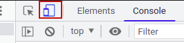

# Roteiro de introdução
O Bootstrap é um framework [responsivo](https://medium.com/jaguaribetech/imagens-responsivas-css3-1403253225c6), bastante utilizado na web ([ver números atuais](https://w3techs.com/technologies/overview/javascript_library)), pronto para o uso.

O framework foi criado inicialmente por uma equipe do Twitter e hoje é mantido como um projeto Open Source ([ver repositório](https://github.com/twbs/bootstrap)).

## Objetivos:
1. Apresentar o link para a documentação oficial
2. Apresentar o template básico do Bootstrap


## Roteiro
A documentação oficial do Bootstrap é encontrada neste link [https://getbootstrap.com/docs/5.1/getting-started/introduction/](https://getbootstrap.com/docs/5.1/getting-started/introduction/). Atualmente a versão recomendada é a 5.1.

O Bootstrap é um framework CSS/JS, ou seja, suas funcionalidades estão escritas em ambas as linguagens. O JS é utilizado nos componentes em que não é possível obter o funcionamento pleno apenas com CSS, mas isso veremos quando chegarmos no roteiro de componentes.

O template padrão do Bootstrap é este:
```html
<!doctype html>
<html lang="pt-br">
  <head>
    <!-- Required meta tags -->
    <meta charset="utf-8">
    <meta name="viewport" content="width=device-width, initial-scale=1">

    <!-- Bootstrap CSS -->
    <link href="https://cdn.jsdelivr.net/npm/bootstrap@5.1.3/dist/css/bootstrap.min.css" rel="stylesheet" integrity="sha384-1BmE4kWBq78iYhFldvKuhfTAU6auU8tT94WrHftjDbrCEXSU1oBoqyl2QvZ6jIW3" crossorigin="anonymous">

    <title>Hello, world!</title>
  </head>
  <body>
    <h1>Hello, world!</h1>

    <!-- Optional JavaScript; choose one of the two! -->

    <!-- Option 1: Bootstrap Bundle with Popper -->
    <script src="https://cdn.jsdelivr.net/npm/bootstrap@5.1.3/dist/js/bootstrap.bundle.min.js" integrity="sha384-ka7Sk0Gln4gmtz2MlQnikT1wXgYsOg+OMhuP+IlRH9sENBO0LRn5q+8nbTov4+1p" crossorigin="anonymous"></script>

    <!-- Option 2: Separate Popper and Bootstrap JS -->
    <!--
    <script src="https://cdn.jsdelivr.net/npm/@popperjs/core@2.10.2/dist/umd/popper.min.js" integrity="sha384-7+zCNj/IqJ95wo16oMtfsKbZ9ccEh31eOz1HGyDuCQ6wgnyJNSYdrPa03rtR1zdB" crossorigin="anonymous"></script>
    <script src="https://cdn.jsdelivr.net/npm/bootstrap@5.1.3/dist/js/bootstrap.min.js" integrity="sha384-QJHtvGhmr9XOIpI6YVutG+2QOK9T+ZnN4kzFN1RtK3zEFEIsxhlmWl5/YESvpZ13" crossorigin="anonymous"></script>
    -->
  </body>
</html>
```
Neste template, deve-se escolher entre a opção 1 (com a biblioteca [Popper](https://popper.js.org/) embutida) e a opção 2 (O Popper separado, podendo inclusive ser omitido). O [Popper](https://popper.js.org/) é utilizado no Bootstrap para implementar os componentes [Popovers](https://getbootstrap.com/docs/5.1/components/popovers/) e [Tooltips](https://getbootstrap.com/docs/5.1/components/tooltips/), se não utilizar nenhum desses componentes, pode optar pela opção dois e omitir o carregamento do Popper.

Para o cenário descrito acima, o template ficará desta forma (não deve-se esquecer de remover o comentário para que o JS seja carregado):
```html
<!doctype html>
<html lang="pt-br">
  <head>
    <!-- Required meta tags -->
    <meta charset="utf-8">
    <meta name="viewport" content="width=device-width, initial-scale=1">

    <!-- Bootstrap CSS -->
    <link href="https://cdn.jsdelivr.net/npm/bootstrap@5.1.3/dist/css/bootstrap.min.css" rel="stylesheet" integrity="sha384-1BmE4kWBq78iYhFldvKuhfTAU6auU8tT94WrHftjDbrCEXSU1oBoqyl2QvZ6jIW3" crossorigin="anonymous">

    <title>Hello, world!</title>
  </head>
  <body>
    <h1>Hello, world!</h1>

    <!-- Option 2: Separate Popper and Bootstrap JS -->
    <script src="https://cdn.jsdelivr.net/npm/bootstrap@5.1.3/dist/js/bootstrap.min.js" integrity="sha384-QJHtvGhmr9XOIpI6YVutG+2QOK9T+ZnN4kzFN1RtK3zEFEIsxhlmWl5/YESvpZ13" crossorigin="anonymous"></script>
  </body>
</html>
```

Neste template, é importante destacar a presença do  `<meta name="viewport" content="width=device-width, initial-scale=1">`, responsável por evitar o desagradável efeito de [renderizar](https://pt.wikipedia.org/wiki/Renderiza%C3%A7%C3%A3o) como se fosse para um notebook/desktop e reduzir o tamanho para caber na tela de um celular. Esta linha está informando que o navegador deve considerar como largura, a largura do dispositivo em que está sendo visualizado, sem redimensionamentos. Este meta é comumente chamado de meta tag de responsividade.


## Atividade
1. Crie um arquivo .html com o template padrão
2. Dentro do `<body>`, utilize algumas tags HTML que já conhece (`<h1>`, `<p>`, etc)
3. Salve o mesmo arquivo (com outro nome) mas removendo o CSS e o JS do Bootstrap, também remova o meta de responsividade, abra os arquivos no navegador e observe as diferenças
4. Pressione F12, procure pelo ícone destacado em vermelho, ative e desative para observar o comportamento em ambos os arquivos
   