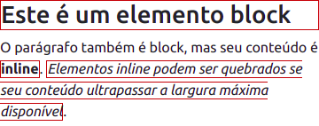

# Roteiro de alinhamento
Este roteiro abordará as formas de alinhamento em elementos/tags _inline_ e _block_. 


nossa experiência com editores de texto nos permite compreender o funcionamento do alinhamento horizontal de forma bastante natural.

## Objetivos
1. Revisar os conceitos de _display_ _block_ e _inline_
2. Realizar alinhamento vertical e horizontal em elementos _inline_ e _block_
## Roteiro

Os elementos _inline_ são comumente os elementos no formato de texto (`<a>`,`<strong>`,`<s>`, incluindo o próprio texto). Este elementos possuem como largura padrão a largura de seu conteúdo (quanto mais conteúdo, mais largo será o elemento). Já os elementos _block_, possuem (por padrão) toda a largura disponível no espaço onde foi colocado, se o elemento com _display_ _block_ for colocado dentro do `<body>`, irá ocupar toda a largura da página.

```html
<style>
  h1, strong, em {
    border: 1px solid rgb(184, 22, 22);
  }
</style>
<h1>Este é um elemento block</h1>

<p>
  O parágrafo também é block, mas seu conteúdo é <strong>inline</strong>. <em>Elementos inline podem ser quebrados se seu conteúdo ultrapassar a largura máxima disponível</em>.
</p>
```

O código acima foi utilizado para gerar a imagem abaixo (omitindo o template padrão já abordado no roteiro anterior).



A figura acima, um _print_ em dispositivo móvel, ilustra os _displays_ abordados neste roteiro, o `<h1>`, por possuir um _display_ _block_ irá ocupar todo o espaço disponível, neste caso, toda a largura da página. O mesmo acontece com o elemento `<p>`, que não teve sua borda destacada. O elemento `<strong>` possui um display _inline_ e sua largura será a de seu conteúdo (quanto mais texto, mais largo será o elemento), isso fica muito evidente ao observarmos o elemento `<em>` que possui um conteúdo maior. Para ficar como anotação, **elementos _block_ não irão quebrar sob nenhuma hipótese, já os elementos _inline_ quebrarão para a linha inferior sempre que não houver espaço disponível para sua exibição**.

### Elementos _inline_
Os elementos _inline_ não podem ser alinhados horizontalmente, pois seguem um fluxo de texto que vai da esquerda para a direita (este é o fluxo padrão, [que pode ser alterado através do CSS](https://developer.mozilla.org/en-US/docs/Web/CSS/direction)). O alinhamento do _inline_ fica limitado ao alinhamento vertical

## Atividade