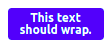
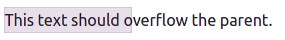
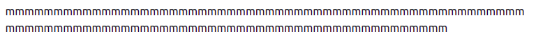

# Roteiro de alinhamento de texto
O alinhamento de texto segue uma lógica diferente do alinhamento de blocos. O alinhamento de texto abordada nesse roteiro segue o mesmo raciocínio do alinhamento já utilizado em editores de texto.

## Objetivos
1. Compreender os tipos de alinhamentos de texto disponíveis
2. Compreender onde utilizá-los
3. Compreender como obter uma formatação diferente dependendo do tamanho do dispositivo

## Roteiro
O alinhamento horizontal é bastante simples, mas com uma observação para a versão 5 do Bootstrap. Os alinhamentos já conhecidos como **esquerda**, **centro** e **direita** existirão aqui, como as respectivas classes `text-start`, `text-center` e `text-end`, mas o alinhamento justificado foi removido da versão 5. Portanto, se o objetivo é alinhar o texto para a direita, teríamos algo como:

```html
<p class="text-end">Lorem ipsum dolor sit, amet consectetur adipisicing elit. Voluptates voluptate, consequuntur molestiae quisquam nemo facilis dicta ad expedita quibusdam deserunt sint praesentium! Adipisci harum numquam facilis quasi laborum, dicta quam?</p>
```
Observem que a formatação foi aplicada no parágrafo inteiro, pois essa é a natureza do alinhamento. Não seria possível perceber a formatação caso o alinhamento fosse aplicado em uma parte deste parágrafo. O exemplo abaixo é uma forma incorreta de sua aplicação:

```html
<p>Lorem ipsum dolor sit, amet consectetur adipisicing elit. Voluptates voluptate, consequuntur molestiae <span clas="text-end">forma INCORRETA de aplicação</span> quisquam nemo facilis dicta ad expedita quibusdam deserunt sint praesentium! Adipisci harum numquam facilis quasi laborum, dicta quam?</p>
```

### Tamanho de dispositivos
O Bootstrap trás alguns recursos para lidar com a resposividade, permitindo ao desenvolvedor optar por uma formatação diferente dependendo do tamanho do dispositivo. Os dispositivos no Bootstrap são classificados pela **largura de sua tela**. A tabela abaixo mostra os tamanhos adotados na versão atual.

| Abreviação | Tamanho | Descrição |
| --- | --- | --- |
| xs | < 576px  | Extra pequeno |
| sm | ≥ 576px | Pequeno |
| md | ≥ 768px | Médio |
| lg | ≥ 992px  | Grande  |
| xl | ≥ 1200px | Extra grande  |
| xxl | ≥ 1400px  | Extra extra grande  |

Estes tamanhos são revisados a cada nova grande versão do Bootstrap (O Extra extra grande não existia na versão 4).

A formatação utilizando a largura deve levar em consideração que ao formatar para um dispositivo, essa formatação se aplica a este tamanho e todos os tamanhos maiores que ele, exemplificando, se aplicar uma formatação para dispositivo médio, esta formatação também será aplicada em dispositivos grande, extra grande e extra extra grande. Se fizermos a formatação para um dispositivo extra pequeno, essa formatação valerá para todos os tamanhos de tela. Outro ponto importante é que a formatação de um tamanho A sempre irá sobrepor a formatação de um tamanho B caso B seja menor que A. Isso quer dizer que se aplicar uma formatação para dispositivo médio e outra para extra grande, a formatação de médio irá valer para médio e grande, já a formatação de extra grande valerá também para extra extra grande.

O alinhamento de texto (e vários outros recursos) podem ser configurados para uma exibição diferente dependendo do tamanho do dispositivo. É possível obter uma alinhamento ao centro em dispositivos grande, extra grande e extra extra grande, mantendo outro tipo de alinhamento nos demais dispositivos. O exemplo abaixo apresenta o explicado anteriormente.

```html
<p class="text-end text-lg-center">Lorem ipsum dolor sit, amet consectetur adipisicing elit. Voluptates voluptate, consequuntur molestiae quisquam nemo facilis dicta ad expedita quibusdam deserunt sint praesentium! Adipisci harum numquam facilis quasi laborum, dicta quam?</p>
```

*Sempre que houver ausência da indicação do tamanho do dispositivo, a formatação valerá para todos os tamanhos*. No exemplo acima, o `text-end` indica que a formatação será para a direita (em dispositivos extra pequeno e todos os maiores que ele), mas a formatação `text-lg-center` está indicando que para dispositivos grandes (e maiores) a formatação será de um alinhamento ao centro. É possível formatar individualmente para cada um dos tamanhos disponíveis, bastando fornecer o seu funcionamento.

Para oferecer outra explicação, montei a tabela abaixo para percebermos qual será o alinhamento, por dispositivo, do exemplo anterior.

| Tamanho | Alinhamento |
| --- | --- |
| xs | direita |
| sm | direita |
| md | direita |
| lg | centro |
| xl | centro |
| xxl | centro |


### Quebra de linha
É possível controlar como o texto se comportará em relação a limitação do espaço disponível. Por padrão o texto quebrará quando não houver espaço disponível para sua exibição completa, mas isso pode ser modificado com as classes `text-wrap` (comportamento padrão, que permite a quebra de linha) e o `text-nowrap` que modifica para impedir qualquer quebra de linha.

Neste exemplo, o espaço disponível para o texto é limitado a `6rem`.



```html
<div class="badge bg-primary text-wrap" style="width: 6rem;">
  This text should wrap.
</div>
```

Agora um exemplo com uma limitação um pouco maior (`8rem`), mas o texto não quebra devido ao `text-nowrap`.


```html
<div class="text-nowrap bd-highlight" style="width: 8rem;">
  This text should overflow the parent.
</div>
```

Neste último exemplo é possível perceber até onde o `<div>` está configurado para ir, pois há um `bd-highlight` para nos auxiliar nesta percepção.

### Quebra de palavra
Outro recurso tambem útil em aplicações/website em que o conteúdo é dinâmico é o de quebra de palavra. Isso pois o comportamento padrão para palavras muito extensas é não quebrá-las. Imaginem uma rede social em que seus usuários podem escrever qualquer conteúdo, a interface poderia quebrar caso algum desses usuários colocasse várias palavras juntas ou simplesmente repetisse o mesmo caractere por centenas de vezes. Para contornar isso, está disponível o `text-break`, que permite fugir do comportamento padrão de não quebrar a palavra.



```html
<p class="text-break">mmmmmmmmmmmmmmmmmmmmmmmmmmmmmmmmmmmmmmmmmmmmmmmmmmmmmmmmmmmmmmmmmmmmmmmmmmmmmmmmmmmmmmmmmmmmmmmmmmmm</p>
```


## Atividade
1. Copie um parágrafo de uma notícia e aplique alinhamento diferente para pelo menos 3 tamanhos de dispositivos.
2. Formate um dos parágrafos para não permitir a quebra de texto.