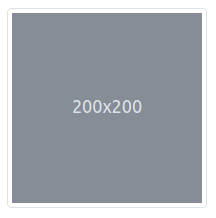
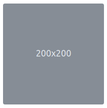
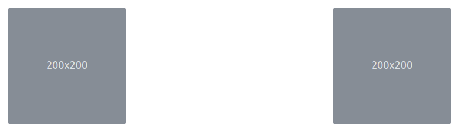
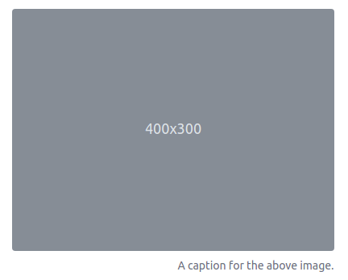

# Imagens
As imagens são elementos que geram algum trabalho para obter-s responsividade. Se definimos um tamanho fixo, telas menores terão que realizar uma rolagem, o mesmo acontece quando não definimos o tamanho (irá exibir no tamanho original da imagem).

## Objetivos
1. Tornar a imagem responsiva
2. Formatar miniaturas
3. Alinhar imagens

## Roteiro
O Bootstrap fornece como recurso para obter a responsividade em imagens através da classe `img-fluid`, que basicamente aplica (através do CSS) uma largura de 100% e uma altura automática. Essa configuração faz com que a imagem seja reduzida caso seja exibida em um dispositivo menor do que o tamanho da imagem. A classe `img-fluid` deve ser aplicado diretamente na tag ``.

```html

```

Essa configuração fará a imagem ocupar todo o espaço disponível. Para fazer com que a imagem não ocupe 100% da tela, é necessário limitar seu espaço (forçando com que a imagem fique dentro de outros elementos com largura limitada).

### Miniaturas
Algumas interfaces lidam com miniaturas de imagens, seja para mostrar um arranjo de imagens miniaturizadas ou como opções clicáveis. Para facilitar a formatação (através da personalização) destas imagens, há a classe `img-thumbnail`, que na configuração padrão acrescentará uma borda na imagem.



```html

```

### Borda arredondada
Também é possível arredondar a borda das imagens utilizando a classe `rounded`, que funciona para imagens e outras _caixas_.



```html

```

### Alinhamento de imagens
O alinhamento de imagens pode ser realizado de duas formas - através do alinhamento de texto, pois a imagem possui o _display inline_ como configuração padrão; assim como o alinhamento realizado através de flutuação.

#### Como texto
No alinhamento realizado por formatação de texto, é necessário formatar a _caixa_ onde a imagem está inserida, como no exemplo abaixo:

```html
<p class="text-center">
  
</p>
```

Neste exemplo, o `<p>` possui uma formatação de alinhamento para texto, que irá alinhar o texto do parágrafo no centro, consequentemente a imagem também. Esse tipo de formatação não é útil quando deseja-se imagens com alinhamentos diferentes.

#### Por flutuação
Já o alinhamento por flutuação permite alinhar cada imagem como desejado, através das classes `float-start` e `float-end`, como no exemplo abaixo:



```html


```

Não existe flutuação ao centro, mas o alinhamento no centro é obtido através da combinação de duas classes, a `d-block` e `mx-auto`, a primeira muda o _display_ da imagem de _inline_ para _block_ e a segunda utiliza a formatação de margens (no eixo cartesiano x) em seu valor automático, portanto essa alternativa seria:

```html

```

Apenas para reforçar, o `rounded` nada está relacionado com o alinhamento.

### Formatação no `<picture>`
A tag `<picture>` do HTML5 permite [definir várias fontes](https://developer.mozilla.org/pt-BR/docs/Web/HTML/Element/picture) para a a mesma imagem que será exibida, permitindo que o navegador possa escolher um formato que melhor se encaixe em um contexto (de exibição) ou um formato que possua bibliotecas para interpretar. Na utilização em conjunto com o `<picture>`, as classes ainda devem ser aplicadas no ``

```html
<picture>
  <source srcset="..." type="image/svg+xml">
  
</picture>
```

### Formatação de `<figure>`
O `<figure>` possui uma [utilização](https://developer.mozilla.org/pt-BR/docs/Web/HTML/Element/figure) distinta `<picture>`, o `<figure>` é utilizado para acrescentar uma informação visual com um certo grau de independência de localização onde é exibido. Geralmente dentro do `<figure>` há uma imagem e uma legenda (embora a legenda seja opcional), onde essa legenda está diretemente relacionado com a imagem e apresenta alguma explicação sobre mesma.

Para o `<figure>`, o Bootstrap possui um conjunto de classes de formatação: `figure`, `figure-img` e `figure-caption`, permitindo uma personalização desse bloco cujo objetivo é apresentar uma imagem com ou sem legenda.



```html
<figure class="figure">
  
  <figcaption class="figure-caption text-end">A caption for the above image.</figcaption>
</figure>
```

Neste exemplo é utilizado a classe `figure` para formatar o elemento `<figure>`, o `figure-img` e `figure-caption` para indicar respectivamente qual é a imagem e sua legenda, assim como a classe que deixa a imagem responsiva e arredondada (`img-fluid` e `rounded`). O alinhamento da legenda obedece as regras de alinhamento de texto, utilizando o `text-end` para alinhar à direita.

## Atividade

1. Escolha uma imagem na internet para aplicar a classe de responsividade sobre imagens e de arredondamento das bordas.
2. Com outras duas imagens, deixe-as na mesma linha, mas uma alinhada à esquerda e outra à direita, uma dessas imagens deve ser formatada como miniatura.