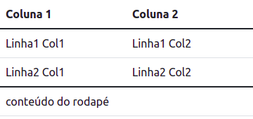
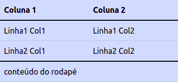
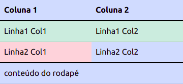
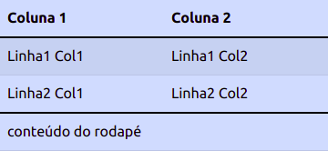
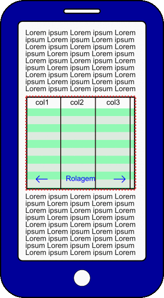

# Tabelas
Tabelas são elementos difíceis de se obter responsividade. Quanto mais colunas a tabela possui, mais espaço ocupa na largura, podendo ultrapassar a largura da página e desconfigurando a interface.

## Objetivos
1. Formatar células e tabelas
2. Criar tabelas responsivas

## Roteiro
Antes de seguirmos é necessário relembrar a estrutura básica de uma tabela no HTML. No HTML5, a tabela possui os elementos básicos apresentados no seguinte exemplo:

```html
<table>
  <!-- cabeçalho -->
  <thead>
    <tr>
      <!-- célula de cabeçalho são com TH -->
      <th>Coluna 1</th>
      <th>Coluna 2</th>
    </tr>
  </thead>

  <!-- Conteúdo -->
  <tbody>
    <tr>
      <td>Linha1 Col1</td>
      <td>Linha1 Col2</td>
    </tr>

    <tr>
      <td>Linha2 Col1</td>
      <td>Linha2 Col2</td>
    </tr>
  </tbody>

  <!-- Rodapé -->
  <tfoot>
    <tr>
      <!-- Colunas podem ser mescladas com o colspan -->
      <td colspan="2">conteúdo do rodapé</td>
    </tr>
  </tfoot>
</table>
```
Neste código de exemplo, que não possui formatação nenhuma pode receber a formatação do Bootstrap acrescentando a classe base para tabelas chamada de `table`. O exemplo acima ficaria assim:

```html
<table class="table">
  <!-- cabeçalho -->
  <thead>
    <tr>
      <!-- célula de cabeçalho são com TH -->
      <th>Coluna 1</th>
      <th>Coluna 2</th>
    </tr>
  </thead>

  <!-- Conteúdo -->
  <tbody>
    <tr>
      <td>Linha1 Col1</td>
      <td>Linha1 Col2</td>
    </tr>

    <tr>
      <td>Linha2 Col1</td>
      <td>Linha2 Col2</td>
    </tr>
  </tbody>

  <!-- Rodapé -->
  <tfoot>
    <tr>
      <!-- Colunas podem ser mescladas com o colspan -->
      <td colspan="2">conteúdo do rodapé</td>
    </tr>
  </tfoot>
</table>
```
A exibição da tabela sai deste formato:


Para este formato:



Um ganho substancial de formatação apenas pelo acréscimo da classe `table` (`<table class="table">`).

### Formatação de cores
As tabelas podem ser formatadas com o sistema de cores do Bootstrap, acrescentando uma das classes de cores disponíveis: `table-primary`, `table-secondary`, `table-success`, `table-danger`, `table-warning`, `table-info`, `table-light` ou `table-dark`. A classe `table` deve sempre ser mantida.




```html
<table class="table table-primary">
  <!-- cabeçalho -->
  <thead>
    <tr class="">
      <!-- célula de cabeçalho são com TH -->
      <th>Coluna 1</th>
      <th>Coluna 2</th>
    </tr>
  </thead>

  <!-- Conteúdo -->
  <tbody>
    <tr>
      <td>Linha1 Col1</td>
      <td>Linha1 Col2</td>
    </tr>

    <tr>
      <td>Linha2 Col1</td>
      <td>Linha2 Col2</td>
    </tr>
  </tbody>

  <!-- Rodapé -->
  <tfoot>
    <tr>
      <!-- Colunas podem ser mescladas com o colspan -->
      <td colspan="2">conteúdo do rodapé</td>
    </tr>
  </tfoot>
</table>
```

Essa formatação também pode ser aplicada na linha e até mesmo em uma célula:



```html
<table class="table table-primary">
  <!-- cabeçalho -->
  <thead>
    <tr class="">
      <!-- célula de cabeçalho são com TH -->
      <th>Coluna 1</th>
      <th>Coluna 2</th>
    </tr>
  </thead>

  <!-- Conteúdo -->
  <tbody>
    <!-- aplicação em linha -->
    <tr class="table-success">
      <td>Linha1 Col1</td>
      <td>Linha1 Col2</td>
    </tr>

    <tr>
      <!-- aplicação em célula -->
      <td class="table-danger">Linha2 Col1</td>
      <td>Linha2 Col2</td>
    </tr>
  </tbody>

  <!-- Rodapé -->
  <tfoot>
    <tr>
      <!-- Colunas podem ser mescladas com o colspan -->
      <td colspan="2">conteúdo do rodapé</td>
    </tr>
  </tfoot>
</table>
```

#### Bordas
Se observar bem entre as colunas, não conseguirá ver separação entre as mesmas, isso porquê a formatação padrão da tabela é sem borda, para forçar a exibição da borda é necessário acrescentar a classe `table-bordered` em `<table>`.

```html
<table class="table table-bordered">
  <!-- conteúdo -->
</table>
```
Essa classe pode ser utilizada com todas as outras já apresentadas e que ainda estão por vir. A única excessão é quanto a utilização junto com o seu antagonista `table-borderless`, este último retira todas as bordas da tabela, inclusive as bordas externas (que são exibidas na forma padrão).
```html
<table class="table table-borderless">
  <!-- conteúdo -->
</table>
```

As bordas da tabela podem ser coloridas com o sistema de cores, através das classes `border-primary`, `border-secondary`, `border-success`, `border-danger`, `border-warning`, `border-info`, `border-light` ou `border-dark`.

```html
<table class="table table-bordered border-success">
  <!-- conteúdo -->
</table>
```

#### Formatação de linhas
Há ainda a formatação automática de alternância de cores entre linhas, aqui representada pela classe `table-striped` aplicado sobre a tabela (junto com a classe `table`).



```html
<table class="table table-primary table-striped">
  <!-- conteúdo -->
</table>
```
Comparando esta última imagem com as anteriores, é possível perceber que há uma alteração de cor entre as linhas da tabela, isso é feito independente da cor escolhida. Há ainda uma classe que altera a cor quando o mouse está sobre a linha, que é a classe `table-hover`, que pode ser utilizada em conjunto com o sistema de cores e o `table-striped`, como no exemplo abaixo:

```html
<table class="table table-primary table-striped table-hover">
  <!-- conteúdo -->
</table>
```

### Responsividade
Para obter a responsividade, exibindo a tabela sem desconfigurar a interface, é necessário criar uma área de exibição para esta tabela, com o objetivo de criar uma rolagem horizontal (que é o principal problema ao se abordar tabelas em dispositivos pequenos) neste espaço, mas sem afetar o restante da interface. A animação abaixo ilustra como a tabela funcionará em um dispositivo móvel.



Esta área de exibição normalmente é implementada através de um `<div>`, mas pode ser utilizado qualquer tag que possua as mesmas características (possua um _display block_), como no exemplo abaixo:

```html
<div class="table-responsive">
  <table class="table">
    <!-- aqui vai o conteúdo da tabela -->
  </table>
</div>
```

A responsividade pode ser configurada dependendo do [tamanho do dispositivo](../03_text_align/README.md#tamanho-de-dispositivos), com uma observação importante, **ao configurar o tamanho do dispositivo, a tabela deixará de ter rolagem horizontal deste tamanho para cima**, ou seja, se configurar como `table-responsive-md`, haverá rolagem horizontal em dispositivos extra pequeno e pequeno, nos dispositivos médios, grande, extra grande e extra extra grande não haverá rolagem horizontal. Os tamanhos disponíveis são: `table-responsive-sm`, `table-responsive-md`, `table-responsive-lg`, `table-responsive-xl` e `table-responsive-xxl`. Utilizar apenas o `table-responsive` deixará a tabela responsiva em todos os tamanhos.

## Atividade
1. Crie uma tabela que alterne as cores de suas linhas mas não possua nenhuma borda (inclusive as externas)
2. Copie a tabela anterior, mas desta vez ela deve possuir todas as bordas, escolha uma das opções disponíveis para as cores de borda
3. Crie uma tabela responsiva, que independente do tamanho do dispositivo ela consiga exibir o seu conteúdo.