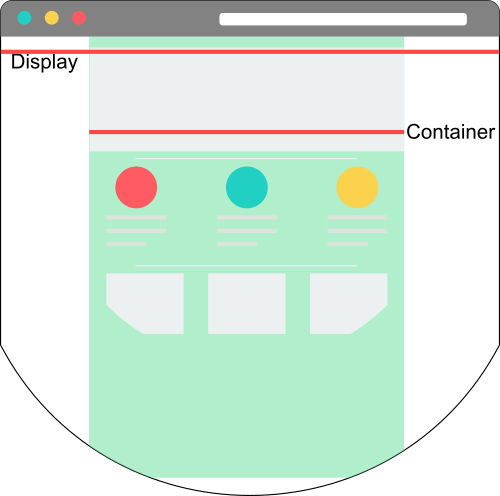

# Containers
Os containers do Bootstrap são utilizados para organizar o conteúdo na página e adaptá-lo (algumas vezes limitando a largura máxima) para melhor acomodar o conteúdo.

## Objetivos
1. Compreender os tipos de containers existentes no Bootstrap

## Roteiro
A escolha do container está bastante relacionado com o _design_ da página, alguns _design_ espalham o seu conteúdo em toda a largura existente no display, outros concentram o seu conteúdo no centro da página. A primeira opção, usar completamente a largura da página, é uma escolha difícil para um _designer_, pois a medida que o tamanho da tela aumenta, há muito espaço que poderá ficar vazio, dando uma impressão desagradável quanto a interface. Para solucionar este problema, o Bootstrap utiliza os _breakpoints_, estabelecendo tamanhos pré definidos para cada tamanho de dispositivos.



A figura acima ilustra a representação do container em relação ao tamanho do display. Como a maioria das interfaces de websites possuem um container limitado, esse container ficará centralizado na página. A primeira linha vermelha ilustra a largura do navegador (que ocupa todo o display), já a segunda linha representa a largura do container, que poderá variar de acordo com nossa escolha de container.

As possibilidades de container são as seguintes:

| Classe CSS | Extra pequeno | Pequeno | Médio | Grande | Extra grande | Extra extra grande |
| :--- | :---: | :---: | :---: | :---: | :---: | :---: |
| `container` | 100% | 540px | 720px | 960px | 1140px | 1320px |
| `container-sm` | 100% | 540px | 720px | 960px | 1140px | 1320px |
| `container-md` | 100% | 100% | 720px | 960px | 1140px | 1320px |
| `container-lg` | 100% | 100% | 100% | 960px | 1140px | 1320px |
| `container-xl` | 100% | 100% | 100% | 100% | 1140px | 1320px |
| `container-xxl` | 100% | 100% | 100% | 100% | 100% | 1320px |
| `container-fluid` | 100% | 100% | 100% | 100% | 100% | 100% |

De acordo com essa tabela, caso o código abaixo seja implementado, o container terá tamanho limitado para dispositivos de tamanho extra grande (xl) e extra extra grande (xxl), para todos os outros (menores) o container ocupará toda a tela.

```html
<!-- ... -->
<body>
  <div class="container-xl">
    <!-- conteúdo -->
  </div>
</body>
</html>
```

Já o `container-fluid`, permite que o conteúdo ocupe *sempre* todo o espaço disponível, independente do tamanho do dispositivo (há aplicações em que isso é necessário).

## Atividade
1. Crie um arquivo html com um `<div>` adaptado para ser um container que ocupe 100% do espaço disponível em dispositivos extra pequeno, pequeno e a partir do dispositivo médio os tamanhos sejam fixos/limitados.