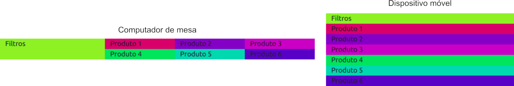
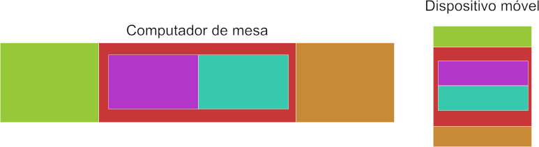

# Sistema de grid
O sistema de grid do Bootstrap é uma organização do *espaço disponível* em um esquema de 12 colunas, com o objetivo de definir quanto de espaço um determinado conteúdo poderá ocupar (dependendo inclusive do tamanho do dispositivo).

## Objetivos
1. Entender o sistema de 12 colunas
2. Compreender a utilização de colunas responsivas
3. Subdivisão responsiva do espaço

## Roteiro
O sistema de 12 colunas do Bootstrap cria uma divisão de um espaço qualquer (pode ser um `container` inteiro ou uma pequena região no rodapé da página) em 12 partes iguais, aqui chamadas de colunas.

Para realizar essa divisão é necessário a utilização de linha(s), semelhante ao que se faz em uma tabela, que é composta por linhas e colunas. No Bootstrap é necessário estabelecer uma linha, representado sempre pela classe `row` e dentro desta, as colunas. Abaixo um pequeno exemplo:

```html
<div class="container">
  <div class="row">
    <div class="col-1">Coluna 01</div>
    <div class="col-1">Coluna 02</div>
    <div class="col-1">Coluna 03</div>
    <div class="col-1">Coluna 04</div>
    <div class="col-1">Coluna 05</div>
    <div class="col-1">Coluna 06</div>
    <div class="col-1">Coluna 07</div>
    <div class="col-1">Coluna 08</div>
    <div class="col-1">Coluna 09</div>
    <div class="col-1">Coluna 10</div>
    <div class="col-1">Coluna 11</div>
    <div class="col-1">Coluna 12</div>
  </div>
</div>
```

Neste exemplo há um `container` (para fazer referência ao conteúdo anterior), mas ele não é obrigatório, pois o `row`-`col` pode ser utilizado em qualquer lugar. *Sempre serão 12 colunas*, caso seja acrescentado uma décima terceira coluna, ela será jogada automaticamente para baixo das 12 já existentes. Neste ponto deve ter percebido que o número pós fixo da classe `col` possui um significado, que é a largura que essa coluna deverá ocupar nesse sistema de 12 colunas.

Caso o exemplo fosse o mostrado abaixo:

```html
<div class="container">
  <div class="row">
    <div class="col-4">Coluna 01</div>
    <div class="col-8">Coluna 02</div>
  </div>
</div>
```

A representação seria esta:


Esta é uma representação em um dispositivo móvel (foi acrescentado cor de fundo as colunas para facilitar a visualização), mas não seria diferente (proporcionalmente) em um dispositivo grande. Na imagem é possível ver que a coluna 01 ocupa 1/3 do espaço disponível e a coluna 02 ocupa os outros 2/3 do espaço disponível. A configuração de `col-4` fez com que a coluna ocupasse 4 espaços dos 12 disponíveis, o mesmo aconteceu com o `col-8` que ocupou 8 espaços. 

O que aconteceria se o código fosse levemente modificado?
```html
<div class="container">
  <div class="row">
    <div class="col-4">Coluna 01</div>
    <div class="col-9">Coluna 02</div>
  </div>
</div>
```


O resultado seria completamente diferente, pois o `col-9` extrapola o espaço que sobrou (`12-4 = 8`), não restando alternativa a não ser coloca-lo abaixo das colunas existentes.

Este comportamento é muito útil ao criar-se uma interface que deve ser responsiva, pois podemos configurar tamanhos diferentes para as colunas dependendo do tamanho do dispositivo e recorrer a este comportamento de "jogar para baixo", forçando o conteúdo a se estender na vertical (que não há limite, pois o usuário pode rolar a barra).

### Coluna dependendo do tamanho do dispositivo
As colunas podem ser configuradas para tamanhos diferentes dependendo do dispositivo, sendo bastante útil para fazer com que o mesmo conteúdo ocupe espaços diferentes. Os prefixos de classe responsivos estão listadas abaixo.

| Tamanho | xs | sm | md | lg | xl | xxl |
| ---: | :---: | :---: | :---: | :---: | :---: | :---: |
| Prefixo | `col-` | `col-sm-` | `col-md-` | `col-lg-` | `col-xl-` | `col-xxl-` |

Estes prefixos necessitam de um número como complemento, como foi feito em todos os exemplos até então. Para o prefixo `col-`, existem as classes `col-1`, `col-2`, `col-3`, até o `col-12`, o mesmo para todos os outros prefixos.

Tome como exemplo a figura abaixo, em que o mesmo código resulta em duas visualizações diferente (dependendo do dispositivo).


Na direita temos uma exibição em computador de mesa, onde normalmente há bastante espaço para exibição, sendo possível exibir os blocos um ao lado do outro, já na versão móvel, pela limitação da largura da tela, há a necessidade de exibir um bloco abaixo do outro.

Uma exibição como a mostrada na ilustração, pode ser obtida com um código semelhante ao abaixo (neste exemplo já não estou exibindo o `<div class="container">`).

```html
<div class="row">
  <div class="col-12 col-lg-4">Coluna 01</div>
  <div class="col-12 col-lg-4">Coluna 02</div>
  <div class="col-12 col-lg-4">Coluna 03</div>
</div>
```

A utilização das classes `col-12` e `col-lg-4` está informando o seguinte:
1. `col-12`: o `<div>` deverá ocupar todo o espaço disponível para dispositivos extra pequeno **e todos os dispositivos maiores**
2. `col-lg-4`: o mesmo `<div>` deverá ocupar 4/12 em dispositivos grandes **e todos os dispositivos maiores**

A formatação para um dispositivo maior sempre irá sobrepor a configuração para um dispositivo menor, o resultado deste código é que em dispositivos extra pequeno, pequeno e médio as colunas ocuparão todo o espaço que houver disponível, para dispositivos grande, extra grande e extra extra grande cada coluna irá ocupará 4/12 (1/3), permitindo até `<div>` na mesma linha.

### Classe de largura automática
Além das classes responsivas há uma classe que formata a coluna com a largura que está disponível, dividindo igualmente este espaço entre todas as colunas automáticas. **A classe é `col`**, sem nenhum sufixo.

```html
<div class="row">
  <div class="col">Coluna 01</div>
  <div class="col">Coluna 02</div>
  <div class="col">Coluna 03</div>
</div>
```
Estas colunas ocuparão cada uma 1/3 do espaço disponível, caso seja acrescentado um novo `<div class="col">`, o espaço das colunas existentes reduzirá para caber as quatro colunas na mesma linha, sempre do mesmo tamanho.

A classe `col` pode ser utilizada junto com as classes responsivas.

```html
<div class="row">
  <div class="col">Coluna 01</div>
  <div class="col-lg-5">Coluna 02</div>
  <div class="col">Coluna 03</div>
</div>
```

Este código gera as seguintes visualizações, respectivamente em dispositivo grande e extra pequeno:


Em dispositivos grandes (e maiores) a coluna 02 deverá ocupar 5 espaços (de 12 disponíveis) e as colunas configuradas apenas com `col` ocuparão o restante do espaço disponível. Quando a visualização é relizada em um dispositivo extra pequeno, a coluna 02 assumirá um valor padrão por não haver configuração para extra pequeno, na configuração padrão a coluna ocupa 100% do espaço disponível (é como se houvesse um `col-12` junto com o `col-lg-5`), isso força as colunas 01 e 03 a não ficarem na mesma linha que a coluna 02. Como cada `col` possui uma linha inteira disponível, ela ocupará esse espaço inteiro.

Abaixo uma modificação no código para acrescentar mais `col` e perceber sua função de dividir o espaço disponível igualmente.

```html
<div class="row">
  <div class="col">Coluna 01</div>
  <div class="col">Coluna 02</div>
  <div class="col-lg-5">Coluna 03</div>
  <div class="col">Coluna 04</div>
  <div class="col">Coluna 05</div>
</div>
```


Neste novo exemplo fica ainda mais evidente o comportamento do `col` em dividir igualmente o espaço disponível.

### Utilização aninhada
A utilização aninhada serve para subdividir um espaço já dividido anteriormente, sempre mantendo a separação máxima de 12 colunas por linha (exceto quando se usa a coluna automática, que não há limites). No exemplo abaixo, apresento uma ilustração de como é a organização dos blocos em um formato móvel e de dispositivo de mesa, assim como o código e a renderização real (com cores nos blocos).


Nesta ilustração o objetivo é compreender a organização dos blocos (no formato real não ficará com estas margens e preenchimentos). Neste exemplo, comum em sites de vendas, observamos um bloco verde na esquerda que conterá os filtros da busca (este bloco reduz e fica bem pequeno, no topo da página na versão móvel), assim como observamos a área de resultados, nesta área serão exibidos os produtos, lado a lado já que os dispositivos maiores permitem. Em uma versão móvel, essa exibição muda para que cada produto seja exibido um abaixo do outro. A área de exibição dos produtos foi subdividida, foi realizado uma utilização **aninhada** da divisão do espaço. Vejam o código correspondente a isso.



É importante notar que na versão renderizada não há todos os espaços disponíveis na ilustração (esta serve apenas para dar uma noção da organização), as cores de alguns blocos simplesmente somem, como é o caso do bloco responsável por armazenar o resultado, que apesar de estar alí, com a cor definida, não aparece visualmente. O código que gerou esta renderização é o código abaixo.

```html
<div class="row">
  <div class="col-12 col-md-4">
    Filtros
  </div>
  <div class="col-12 col-md-8">
    <div class="row">
      <div class="col-md-4 col-12">Produto 1</div>
      <div class="col-md-4 col-12">Produto 2</div>
      <div class="col-md-4 col-12">Produto 3</div>
      <div class="col-md-4 col-12">Produto 4</div>
      <div class="col-md-4 col-12">Produto 5</div>
      <div class="col-md-4 col-12">Produto 6</div>
    </div>
  </div>
</div>
```
Neste trecho de código é importante enfatizar a presenta do segundo `<div class="row">`, ele está aparecendo dentro de uma coluna que em dispositivos médios (em diante) ocupa 1/3 do espaço, mas em dispositivos menores irá ocupar todo o espaço disponível. Esta coluna está recebendo uma subdivisão (o `row` representa isso) novamente em 12 colunas, recebendo dentro 6 regiões que irão ocupar tamanhos diferente dependendo do dispositivo. Mas sempre a divisão será do espaço que está disponível, caso o espaço disponível seja a tela inteira, ela será dividida em 12 colunas, se o espaço for de apenas uma parte da tela, essa pequena parte da tela também será dividida em 12 colunas (iguais).

## Atividade
> As ilustrações não são renderizações reais, a altura dos blocos são meramente ilustrativos, as renderizações terão a altura de seu conteúdo (não usem a altura como parâmetro para saber se está fazendo correto ou não)

1. Observe os blocos da figura abaixo e crie um código HTML (usando Bootstrap) que seja capaz de obter a mesma organização/comportamento em seus respectivos dispositivos (encare como dispositivo de mesa os que são grande, extra grande e extra extra grande, os móveis são os restantes). As colunas possuem a mesma largura.
   
2. Observe agora que um dos blocos ocupa 2/3 do espaço disponível e o outro bloco ocupa 1/3 (na versão para desktop). Na versão móvel ambos ocupam todo o espaço disponível.
   
   
3. Aproveite que entendeu o conceito de aninhamento e construa uma solução para o diagrama mostrado abaixo.

    