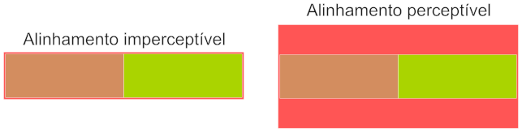
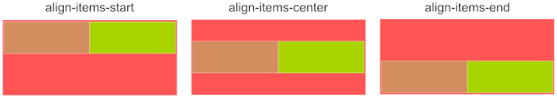
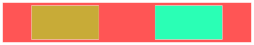

# Alinhamento e ordenação de blocos
Os alinhamentos e e ordenação de blocos presentes no Bootstrap estão possuem garantias de funcionamento em áreas que fazem uso do [flexbox](https://developer.mozilla.org/pt-BR/docs/Web/CSS/CSS_Flexible_Box_Layout/Basic_Concepts_of_Flexbox). No Bootstrap, qualquer área pode ser transformada em "área flexbox", fazendo uso da classe `d-flex` (na prática isso é a mudança da propriedade *display* do CSS para flex, `display: flex`). O sistema de grid apresentado anteriormente já faz uso do flexbox, portanto tudo o que será apresentado aqui funcionará com o sistema de grid.

É extremamente importante enfatizar que o alinhamento abordado aqui não deve ser confundido com o alinhamento de texto (elementos *inline*), que já foi abordado nos roteiros iniciais. Este alinhamento se aplica a elementos cujo *display* é *block* (`display: block`).

## Objetivos
1. Alinhar verticalmente e horizontalmente elementos do tipo *block*.
2. Estabelecer a ordem de exibição dos elementos (que pode ser diferente da que foi escrita no html).

## Roteiro
Caso o plano seja aplicar os recursos descritos aqui em algo que não seja o sistema de grid (ou seja, **não existe** um `<div class="row">`), deverá forçar um `display: flex` utilizando a classe `d-flex`, como no exemplo abaixo.

```html
<section class="d-flex">
  <div>Bloco 1</div>
  <div>Bloco 2</div>
</section>
```
Os recursos descritos aqui serão aplicados na mesma tag onde está o `d-flex`. No sistema de grid, a classe `row` força o *flex* no mesmo elemento, sendo desnecessário o uso do `d-flex`.

### Alinhamento 
Os alinhamentos de blocos são divididos em alinhamento vertical e horizontal.

#### Alinhamento vertical
As opções de alinhamento vertical são três, no topo da área (início), no centro e no rodapé (fim). Este tipo de alinhamento só será perceptível quando a **altura** do elemento que irá conter os que serão alinhados é maior (em altura) do que seu conteúdo. 



A ilustração exemplifica a percepção do alinhamento, em que os blocos internos são da mesma altura que o bloco que irá contê-los, sendo impossível perceber se estão alinhados no início, centro ou fim. Já a figura da direita mostra os blocos internos menores que a área do bloco antecessor, sendo possível identificar um alinhamento horizontal ao centro. Resumindo, o alinhamento vertical somente será perceptível se o desenvolvedor forçar uma altura para o bloco de contenção e essa altura for maior que os blocos internos. Para o exemplo acima seriam possíveis 3 tipos de alinhamentos.



Os alinhamentos são no início (`align-items-start`), no centro (`align-items-center`) e no fim (`align-items-end`). Representados pelo código abaixo que faz uso do sistema de grid.

```html
<div class="row align-items-start">
  <div class="col-4">Bloco 1</div>
  <div class="col-4">Bloco 2</div>
</div>
```

```html
<div class="row align-items-center">
  <div class="col-4">Bloco 1</div>
  <div class="col-4">Bloco 2</div>
</div>
```

```html
<div class="row align-items-end">
  <div class="col-4">Bloco 1</div>
  <div class="col-4">Bloco 2</div>
</div>
```

Como já mencionado anteriormente, caso não esteja usando o sistema de grid, é necessário forçar um `display: flex`, como no exemplo abaixo.

```html
<div class="d-flex align-items-center">
  <div>Bloco 1</div>
  <div>Bloco 2</div>
</div>
```

#### Alinhamento horizontal
Já o alinhamento horizontal é mais perceptível de se notar, pois na exibição *flex* os blocos perdem o comportamento natural de ocupar todo o espaço disponível para ocupar apenas a largura de seu conteúdo (ou a largura definida através do CSS), normalmente sobrando espaço. É nesse espaço que o alinhamento horizontal será feito. As opções são: no início (`justify-content-start`), no centro (`justify-content-center`), no fim (`justify-content-end`), ao redor (`justify-content-around`), entre (`justify-content-between`) e uniforme (`justify-content-evenly`).

`justify-content-start`
: Os blocos são alinhados no início (esquerda), podendo sobrar espaço vazio no fim (direita).


`justify-content-center`
: Os blocos são alinhados no centro, sobrando espaço no início e no fim.


`justify-content-end`
: Os blocos são alinhados no fim, sobrando espaço no início.


`justify-content-around`
: O espaço de sobra é dividido igualmente ao redor dos blocos, ou seja, a distância entre os blocos é maior do que a distância para o início e o fim.



`justify-content-between`
: Todo o espaço de sobra ficará entre os blocos, alinhando os blocos no início e no fim.


`justify-content-evenly`
: O espaço é dividido uniformemente, a distância entre os elementos será a mesma distância entre o elemento e as bordas de início e fim.


Para não escrever um código para cada, colocarei apenas um código de exemplo, mas que serve para todos os outros, bastando alterar a classe que será utilizada.

```html
<div class="row justify-content-between">
  <div class="col-4">Bloco 1</div>
  <div class="col-4">Bloco 2</div>
</div>
```
Neste código, será utilizado o alinhamento entre os elementos, forçando os blocos a tocarem as margens da direita e esquerda. O mesmo pode ser feito, trocando a classe `justify-content-between` pela classe de alinhamento desejada. É importante notar que **não se deve utilizar mais de uma classe de alinhamento no mesmo elemento!**

### Ordenação
A ordem natural de apresentação dos elementos é a que foi codificada no HTML, o primeiro a ser escrito no código será o elemento mais à esquerda. Com as classes utilitárias de ordenação, é possível alterar essa ordem de forma responsiva, ou seja, ter um comportamento diferente dependendo do tamanho dispositivo.

As classes de ordenação possuem prefixo `order-`, variando de *1* a *5*, sendo a primeira a classe `order-1`. A variação para adequar ao tamanho do dispositivo é acrescida entre o prefixo `order-` e o número. Para um bloco que deve ser o primeiro a aparecer em dispositivo médio em diante, a classe adequada seria `order-md-1`. Além das classes numeradas, há as classes com terminação `first` e `last` (`order-first`, `order-last`, `order-lg-first`, `order-lg-last`, etc), que respectivamente representam a exibição como primeiro e último.

```html
<div class="row">
  <div class="col-3 order-last">Bloco 1</div>
  <div class="col-3 order-5">Bloco 2</div>
  <div class="col-3 order-4">Bloco 3</div>
  <div class="col-3 order-3">Bloco 4</div>
  <div class="col-3 order-2">Bloco 5</div>
  <div class="col-3 order-1">Bloco 6</div>
  <div class="col-3 order-first">Bloco 7</div>
</div>
```

O código acima possui a renderização abaixo (os blocos foram coloridos para facilitar a visualização do limite de cada um).


Na renderização é possível observar que a ordem de exibição está completamente diferente da ordem em que foi escrito o código. O código acima funciona exatamente igual para todos os dispositivos, por não ter sido utilizado os modificadores para tamanho de dispositivo (`xs`, `sm`, `md`, `lg`, `xl` e `xxl`).

## Atividade
1. 