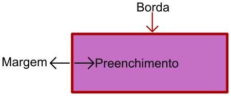
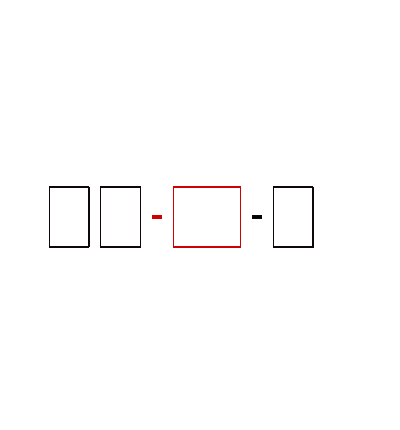

# Margens e Preenchimento
As margens e preenchimentos são os recursos utilizados para retirar aquele visual "grudado" que fica na interface logo após a diagramação, onde separamos o espaço para cada elemento visual. O que antes ficaria "junto e misturado", agora poderá se distanciar e apresentar uma tela mais amigável.

## Objetivos
1. Conseguir utilizar as classes de margens.
2. Conseguir utilizar as classes de preenchimento.

## Roteiro
É necessário iniciar diferenciando a margem do preenchimento. A ilustração abaixo nos ajudará a compreender melhor estes dois conceitos.



Na imagem a borda está em uma cor próxima do vinho, esta borda será o nosso referencial para diferenciar margem de preenchimento. A borda pode ter uma espessura qualquer ou pode ser nula (valor zero). A margem é a distância do elemento (contando a partir da borda) para o seu vizinho, já o preenchimento é a distância da borda para o conteúdo dentro do elemento. Portanto, se o objetivo for distanciar o elemento de seus vizinho, devemos recorrer às margens, se o objetivo é "encorpar" o elemento, distanciando o conteúdo das bordas, recorremos ao preenchimento.

É possível configurar as quatro margens e preenchimentos (superior/*top*, inferior/*bottom*, esquerda/início/*start* e direita/fim/*end*) para os seis tamanhos de dispositivos do Bootstrap. Para cada um, é possível escolher sete opções de margens/preenchimento, todas padronizadas para garantir coerência na interface.

Caso o objetivo seja utilizar uma margem, a classe irá iniciar com o caractere **m**, para um preenchimento o caractere inicial será **p**. Se o objetivo é formatar a margem do topo, acrescenta-se o caractere **t**, ficando **mt** (*margin top*), caso fosse um preenchimento inferior a classe iria ter o prefixo **pb** (*padding bottom*). O detalhamento abaixo irá descrever todas as opções possíveis logo após o **m** ou **p**.

**t**
: *top* - Faz referência a parte superior (ex: `mt-`, *margin top*).

**b**
: *bottom* - Faz referência a parte inferior (ex: `pb-`, *padding bottom*).

**s**
: *start* - Faz referência à esquerda (ex: `ms-`, *margin start*).

**e**
: *end* - Faz referência à direita (ex: `pe-`, *padding end*).

**x**
: *eixo X* - Faz referência ao eixo X do plano cartesiano, ou seja, a configuração vale para a direita e esquerda (ex: `mx-`, *margin X*).

**y**
: *eixo Y* - Faz referência ao eixo Y, parte superior e inferior (ex: `py-`, *padding Y*).

**vazio**
: Não utiliza nenhuma das opções anteriores. Irá formatar **todos** os lados (ex: `m-`, *margin*).

Algumas das combinações possívels com o que já temos: `mt-`, `mb-`, `m-`, `mx`, `p-`, `py-`, etc. Este prefixo é complementado com o tamanho do dispositivo, ex: `mt-md-`. Neste exemplo está orientando a formatar a margem do topo, em dispositivos médios em diante com o número que virá logo em seguida. 

As opções para os tamanhos são os mesmos já mencionados anteriormente: `xs`, `sm`, `md`, `lg`, `xl` e `xxl`, caso a informação do tamanho de dispositivo seja omitido, a configuração de preenchimento ou margem será utilizado em todos os tamanhos.

Para completar a classe é necessário acrescentar no final um dos tamanhos de margem/preenchimento disponíveis, que são sete ao todo. Os tamanhos variam de `0` a `5`, onde o tamanho `0` representa a inexistência de margem ou preenchimento e 5 é a maior margem/preenchimento possível. O último tamanho disponível é o `auto`, em que o objetivo é configurar a margem automaticamente (geralmente para centralizar, pois irá configurar a mesma margem na esquerda e direita).

Com esta última parte, formamos a classe final, como nos exemplos: `mt-sm-2`, `mt-1`, `px-lg-1`, `px-2`, etc.



Com o gabarito da animação acima é possível construir qualquer classe das margens e preechimentos. Onde informa que é opcional, o usuário pode omitir (**mas NÃO deve simplesmente substituir por um espaço vazio**) o bloco correspondente (no caso do tamanho do dispositivo, deve omitir também o `-`).

O exemplo abaixo mostra uma utilização para as margens e preenchimentos.

```html
<div class="container">
  <header class="row">
    <div class="col-12 col-md-4">LOGOMARCA</div>
    <div class="col-12 col-md-8">Menu de navegação</div>
  </header>
  <section class="row mt-2">
    <div class="col-12 col-md-4 px-1 px-md-3">Produto 1</div>
    <div class="col-12 col-md-4 px-1 px-md-3">Produto 2</div>
    <div class="col-12 col-md-4 px-1 px-md-3">Produto 3</div>
    <div class="col-12 col-md-4 px-1 px-md-3">Produto 4</div>
    <div class="col-12 col-md-4 px-1 px-md-3">Produto 5</div>
  </section>
</div>
```

As classes de margem e preenchimento utilizadas no exemplo foram `mt-2` (Margem no topo de tamanho 2, para todos os tamanhos de dispositivos), `px-1` (preenchimento na esquerda e direita de tamanho 1 para todos os tamanhos de dispositivos) e `px-md-3` (preenchimento de tamanho 3 em dispositivos médios e maiores). Neste exemplo em que há uma sobreposição entre `px-1` e `px-md-3`, a configuração de tamanho maior será utilizada para o dispositivo informado e os maiores, isso quer dizer que em dispositivos `xs` e `sm`, o preenchimento será 1, mas nos dispositivos `md`, `lg`, `xl` e `xxl` o preenchimento será de tamanho 3.

## Atividade
```html
<style>
  .borda {
    border: 1px solid black;
  }
</style>
<div class="d-flex">
  <div class="borda">Conteúdo 1</div>
  <div class="borda">Conteúdo 2</div>
  <div class="borda">Conteúdo 3</div>
</div>
```
1. Considerando o código acima, formate as margens para que os elementos se distanciem um pouco um do outro (qualquer distância);
2. Em quase todos os blocos não há distância entre a borda e o conteúdo, solucione este problema no no mesmo código apresentado no início da atividade