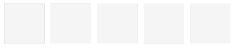
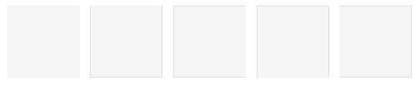
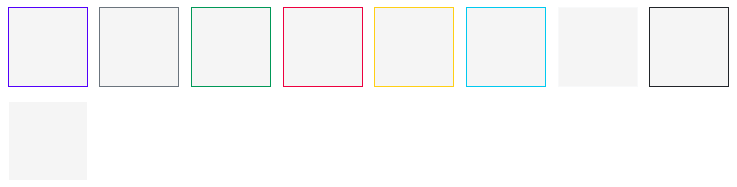
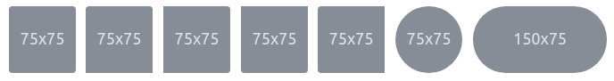
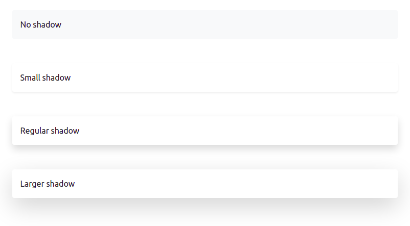
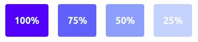

# Borda, Sombra e opacidade
Os recursos de borda, sombra e opacidade são recursos que podem auxiliar na composição de uma interface, chamando a atenção do usuário ou desviando o seu olhar. De uma perspectiva puramente estética, os três recursos ainda ajudam a criar formas mais agradáveis.

## Objetivos
1. Aprender a utilizar as classes de borda, sombra e opacidade.

## Roteiro
A sequência que será abordada é a mesma do título, iniciando pelas bordas.

### Bordas
A classe `rounded`, que é uma classe de borda, já foi apresentada no roteiro de imagens e será novamente abordada aqui. No Bootstrap a abordagem das bordas são duas, a abordagem **aditiva** e a abordagem **subtrativa**. Em ambas as abordagens é possível controlar cada uma das bordas (superior, inferior, direita e esquerda) individualmente ou todas ao mesmo tempo.

Na **abordagem aditiva** o objetivo é acrescentar borda a algo que não possui. As classes são: `border` (borda nos quatro lados), `border-top` (borda superior), `border-bottom` (borda inferior), `border-start` (borda esquerda) e `border-end` (borda direita).


```html
<span class="border"></span>
<span class="border-top"></span>
<span class="border-end"></span>
<span class="border-bottom"></span>
<span class="border-start"></span>
```

Já na **abordagem subtrativa**, o objetivo da classe é retirar uma borda já existente (mesmo que tenha sido acrescentado por uma classe de borda).


```html
<span class="border border-0"></span>
<span class="border border-top-0"></span>
<span class="border border-end-0"></span>
<span class="border border-bottom-0"></span>
<span class="border border-start-0"></span>
```
Neste exemplo, a classe `border` acrescenta todas as bordas, mas uma delas é removida logo em seguida.

#### Cores de borda
As cores de borda são as mesmas cores existentes em todo o framework, `border-primary`, `border-secondary`, `border-success`, `border-danger`, `border-warning`, `border-info`, `border-light`, `border-dark` e `border-white`.



```html
<span class="border border-primary"></span>
<span class="border border-secondary"></span>
<span class="border border-success"></span>
<span class="border border-danger"></span>
<span class="border border-warning"></span>
<span class="border border-info"></span>
<span class="border border-light"></span>
<span class="border border-dark"></span>
<span class="border border-white"></span>
```

#### Espessura da borda
A espessura da borda também pode ser controlada entre níveis pré-existentes, que variam do `0` ao `5`, sendo o `0` já usado como um "removedor de borda". As classes para controlar a espessura de borda são: `border-0` (remove tudo), `border-1`, `border-2`, `border-3`, `border-4` e `border-5`. **Não existem as variações como `border-end-3`**.


```html
<span class="border border-1"></span>
<span class="border border-2"></span>
<span class="border border-3"></span>
<span class="border border-4"></span>
<span class="border border-5"></span>
```

#### Borda arredondada
A borda pode possuir um arredondamento que pode ser configurado individualmente (por lado) e ainda em opções que fazem parecer círculos, como no exemplo abaixo.


```html


```
Nas opções `rounded-circle` e `rounded-pill` as bordas são configuradas para fazerem o bloco parecer que foram recortados, funcionando muito bem em imagens. *Reparem que nas imagens os atributos `src` e `alt` estão com `...` por não serem o objetivo deste roteiro*.


A borda arredondada ainda pode ter seu raio de arredondamento ajustado entre as opções `rounded-0`, `rounded-1`, `rounded-2` e `rounded-3`.

### Sombra
As opções de sombra são mais limitadas (em relação a borda), em que somente é possível escolher entre: 

`shadow-none`
: Nenhuma sombra

`shadow-sm`
: Sombra pequena

`shadow`
: A sombra considerada regular

`shadow-lg`
: Sombra grande

Abaixo a imagem ilustra a diferença entre as sombras.



```html
<div class="shadow-none p-3 mb-5 bg-light rounded">No shadow</div>
<div class="shadow-sm p-3 mb-5 bg-body rounded">Small shadow</div>
<div class="shadow p-3 mb-5 bg-body rounded">Regular shadow</div>
<div class="shadow-lg p-3 mb-5 bg-body rounded">Larger shadow</div>
```

Note que além da sombra, outros recursos foram utilizados (preenchimento, margem, arredondamento de borda e cores).

### Opacidade
Diferente da [opacidade de texto](../02_cores/README.md#opacidade), que implementa uma mistura de cores entre a cor do texto e a cor de fundo, a opacidade tratada aqui é uma opacidade para o elemento (que pode ser um bloco com muitos elementos internos). Este controle de opacidade é muito mais preciso e recorre a transparência existente no CSS. Estas classes podem ser utilizadas em qualquer elemento, sem excessão. **As opções são:** `opacity-100`, `opacity-75`, `opacity-50` e `opacity-25`.



```html
<div class="opacity-100">...</div>
<div class="opacity-75">...</div>
<div class="opacity-50">...</div>
<div class="opacity-25">...</div>
```

Para melhor compreender o conceito de opacidade, clique [neste link](https://pt.wikipedia.org/wiki/Opacidade).

## Atividade

1. Crie uma página que divida o área do container em duas colunas (em que cada uma ocupe metade do espaço disponível). Uma das colunas deverá ter todas as suas bordas em uma cor que não seja branco nem cinza, a outra coluna deverá ter algum tipo de sombra (pequena, regular ou grande).
2. Na mesma página anterior, acrescente uma imagem com bordas arredondadas e com opacidade de 75%.