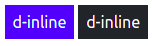
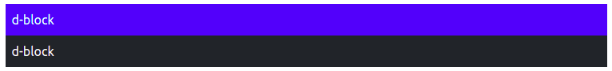

# Posicionamento, redimensionamento e exibição de elementos
O Bootstrap possui algumas classes utilitárias para ajudar a lidar com coisas corriqueiras como a posição que um elemento deverá ocupar, o tamanho que esse elemento deverá ocupar na tela ou no espaço disponível e como ou se esses elementos deverão ser exibidos. Isso não é novidade, já que é possível definir isso rapidamente com o CSS, a vantagem ofertada pelo Bootstrap é a responsividade, conseguir um comportamento diferente dependendo do dispositivo, sem ter que recorrer aos *[media query](https://developer.mozilla.org/pt-BR/docs/Web/CSS/Media_Queries/Using_media_queries)* do CSS.

## Objetivos
1. Conseguir utilizar as classes utilitárias de posicionamento, redimensionamento e exibição, associando a responsividade.

## Roteiro
As classes utilitárias estão disponíveis para conseguir algum comportamento sem a necessidade de criar *media query* para tamanhos específicos, pois isso já foi feito anteriormente pelos desenvolvedores do Bootstrap.

### Posicionamento
O CSS disponibiliza alguns *position* e isso não é complexo de configurar (basta escolher através da propriedade `position`, exemplo: `position: absolute`), mas conseguir um comportamento diferente dependendo do dispositivo irá necessitar de mais linhas de código.

Todos os *positions* existentes no CSS podem ser utilizados através destas classes (que não são responsivas): `position-static`, `position-relative`, `position-absolute`, `position-fixed` e `position-sticky`. Estas classes basicamente fazem uso da propriedade [`position`](https://developer.mozilla.org/pt-BR/docs/Web/CSS/position) do CSS.

Alguns comportamentos são utilizados com mais frequência, que é o caso de deixar algum elemento fixo na tela independente de onde está a barra de rolagem. Este comportamento pode ser obtido com as classes `fixed-top` e `fixed-bottom` para deixar fixo no topo e no rodapé (respectivamente). Estas duas classes não possuem versão responsiva.

Outro comportamento desejado é de um elemento acompanhar o conteúdo da região em que foi inserido, mas ao rolar a barra, ele não sumir da tela, passar a se comportar como um elemento fixo. No CSS este *position* é chamado de `sticky`, aqui no Bootstrap ele possui versões responsivas: `sticky-sm-top`, `sticky-md-top`, `sticky-lg-top` e `sticky-xl-top`. Para compreender melhor o Sticky, abra a [documentação do position](https://developer.mozilla.org/pt-BR/docs/Web/CSS/position), escolha o `position: sticky` e manipule a barra de rolagem do primeiro exemplo.

### Redimensionamento
O redimensionamento de elementos pode ser realizado na largura e altura. As classes de atalho para o redimensionamento em largura são: `w-25`, `w-50`, `w-75`, `w-100` e `w-auto`, representando, respectivamente, uma largura de 25%, 50%, 75%, 100% e automático. Essa porcentagem é em relação ao espaço disponível para o elemento. O tamanho automático irá manter o tamanho padrão do HTML.


```html
<div class="bg-primary" style="width: 400px">
  <div class="w-50 bg-secondary">Bloco</div>
</div>

<div class="bg-primary" style="width: 450px">
  <div class="w-50 bg-secondary">Bloco</div>
</div>
```
O código acima é renderizado desta forma:


Percebam que a largura foi forçada através do CSS, no primeiro para `400px` e no segundo para `450px`, internamente o bloco possui o mesmo código, fazendo uso do `w-50`, mas a representação final será diferente pois os 50% do primeiro `<div>` será diferente do segundo.

Para a altura também existem as classes `h-25`, `h-50`, `h-75`, `h-100` e `h-auto`.

Além de definir a largura e altura, também é possível definir a [largura](https://developer.mozilla.org/pt-BR/docs/Web/CSS/max-width) e [altura](https://developer.mozilla.org/en-US/docs/Web/CSS/max-height)máximas.

### Exibição
O [display do CSS](https://developer.mozilla.org/pt-BR/docs/Web/CSS/display) nos permite escolher como um elemento será renderizado, se no formato de bloco, *inline* (como texto) e até mesmo se ele não será exibido. As classes para *display* no Bootstrap são representadas assim: `d-none`, `d-inline`, `d-inline-block`, `d-block`, `d-grid`, `d-table`, `d-table-cell`, `d-table-row`, `d-flex` e `d-inline-flex`. Estas classes são responsivas e configuram esse *display* para o tamanho `xs` em diante. Para configurar em outros dispositivos, existirão as variantes `d-sm-none`, `d-md-none` e assim por diante, para todos os tamanhos (`sm`, `md`, `lg`, `xl` e `xxl`) e para todos os *display* já abordados.


```html
<div class="d-inline p-2 bg-primary text-white">d-inline</div>
<div class="d-inline p-2 bg-dark text-white">d-inline</div>
```


```html
<div class="d-block p-2 bg-primary text-white">d-block</div>
<div class="d-block p-2 bg-dark text-white">d-block</div>
```

#### Escondendo elementos
Para esconder elementos, basta optar pela classe (e suas variações de tamanho de *display*) `d-none` (`d-sm-none`, `d-md-none`, etc). Esta classe irá esconder o elemento no tamanho escolhido em diante. Para esconder um elemento em um dispositivo menor e manter a exibição em um dispositivo maior, opta-se por utilizar duas classes de display, como no exemplo abaixo.

```html
<div class="d-none d-md-inline p-2 bg-primary text-white">Invisível em xs e sm</div>
<div class="d-inline p-2 bg-dark text-white">d-inline</div>
```

A renderização do código acima muda de acordo com o tamanho do dispositivo. A animação abaixo mostra o redimensionamento do display até atingir um tamanho médio.


O elemento fica escondido em dispositivos extra pequeno e pequeno, mas passa a ser exibido (como *inline*) em dispositivos médios e maiores.

#### Exibição para impressão
Quando a página trabalha com uma perspectiva para impressão (exemplo: sites de receitas culinárias), é necessário esconder alguns elementos (em mídia impressa a economia de tinta é um dos objetivos). Para facilitar essa manipulação, estão disponíveis as classes `d-print-none`, `d-print-inline`, `d-print-inline-block`, `d-print-block`, `d-print-grid`, `d-print-table`, `d-print-table-row`, `d-print-table-cell`, `d-print-flex` e `d-print-inline-flex`.

No mesmo exemplo adotado anteriormente, o primeiro bloco não será exibido durante a impressão.
```html
<div class="d-print-none d-inline p-2 bg-primary text-white">Invisível durante a impressão</div>
<div class="d-inline p-2 bg-dark text-white">d-inline</div>
```

## Atividade
1. Crie uma página em que alguns elementos sejam exibidos e escondidos em tamanhos de dispositivos diferentes.
2. Escolha um desses elementos para possuir uma largura de 75%.
3. Escolha um outro elemento para só aparecer durante a impressão.