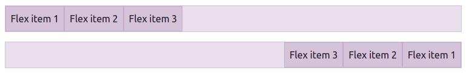
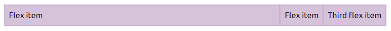

# Flexbox
O [flexbox](https://developer.mozilla.org/pt-BR/docs/Web/CSS/CSS_Flexible_Box_Layout/Basic_Concepts_of_Flexbox) é um recurso apresentado no CSS3 e que solucionou a maioria dos problemas de disposição de elementos em uma página HTML. O Bootstrap é anterior a este recurso e se modernizou, alterando seus códigos para fazer uso do flexbox internamente, além de oferecer alguns recursos já prontos para quem deseja fugir do [sistema de grid](../09_align_sort/README.md).

## Objetivos
1. Conhecer as classes responsivas do flexbox disponíveis no Bootstrap.

## Roteiro
Para utilizar o flexbox é necessário habilitar o recurso através da classe `d-flex` (o flexbox será habilitado dentro do elemento) e o `d-inline-flex` que faz o mesmo que o anterior, mas o bloco passará a se comportar como os elementos de texto. Perceba a diferença abaixo.


```html
<div class="d-flex p-2 bd-highlight">I'm a flexbox container!</div>
```


```html
<div class="d-inline-flex p-2 bd-highlight">I'm an inline flexbox container!</div>
```

Dentro de ambos todos os recursos do flexbox estará disponível, mas o `d-inline-flex` altera o tamanho do elemento para que ele passe a ter a largura do conteúdo, já o `d-flex` mantém o elemento ocupando 100% do espaço disponível.

Há também as variações `d-sm-flex`, `d-md-flex`, `d-lg-flex`, `d-xl-flex`, `d-xxl-flex`, `d-sm-inline-flex`, `d-md-inline-flex`, `d-lg-inline-flex`, `d-xl-inline-flex` e `d-xxl-inline-flex`.

### Direção dos elementos internos
A grande vantagem do flexbox é poder formatar a disposição dos elementos internos de acordo com a necessidade. As disposições disponíveis são em *linha* e *coluna*. Em ambas as disposições, elas podem ser invertidas.


```html
<div class="d-flex flex-row bd-highlight mb-3">
  <div class="p-2 bd-highlight">Flex item 1</div>
  <div class="p-2 bd-highlight">Flex item 2</div>
  <div class="p-2 bd-highlight">Flex item 3</div>
</div>
<div class="d-flex flex-row-reverse bd-highlight">
  <div class="p-2 bd-highlight">Flex item 1</div>
  <div class="p-2 bd-highlight">Flex item 2</div>
  <div class="p-2 bd-highlight">Flex item 3</div>
</div>
```

Os elementos internos estão sendo dispostos ao longo da linha, no primeiro exemplo a exibição é da esquerda para a direita, representado pelo `flex-row` e no segundo exemplo a ordem está invertida, implementado pelo `flex-row-reverse`.


```html
<div class="d-flex flex-column bd-highlight mb-3">
  <div class="p-2 bd-highlight">Flex item 1</div>
  <div class="p-2 bd-highlight">Flex item 2</div>
  <div class="p-2 bd-highlight">Flex item 3</div>
</div>
<div class="d-flex flex-column-reverse bd-highlight">
  <div class="p-2 bd-highlight">Flex item 1</div>
  <div class="p-2 bd-highlight">Flex item 2</div>
  <div class="p-2 bd-highlight">Flex item 3</div>
</div>
```
O mesmo pode ser feito na disposição em coluna com o `flex-column` e `flex-column-reverse`, mas neste formato os elementos internos irão ocupar 100% da largura disponível.

Nos dois casos estarão disponíveis as variações responsivas para a linha `flex-sm-row`, `flex-sm-row-reverse`, `flex-md-row`, `flex-md-row-reverse`, `flex-lg-row`, `flex-lg-row-reverse`, `flex-xl-row`, `flex-xl-row-reverse`, `flex-xxl-row`, `flex-xxl-row-reverse` e também as versões para coluna `flex-sm-column`, `flex-sm-column-reverse`, `flex-md-column`, `flex-md-column-reverse`, `flex-lg-column`, `flex-lg-column-reverse`, `flex-xl-column`, `flex-xl-column-reverse`, `flex-xxl-column` e `flex-xxl-column-reverse`.

## Alinhamento e ordem dos blocos internos
O alinhamento e ordem dos blocos internos é implementado com o [recurso já apresentado anteriormente](../09_align_sort/README.md).

## Crescimento e encolhimento de elementos
Como o flexbox foi concebido para lidar com dispositivos de tamanhos diferentes, não poderia faltar um recurso que orientasse como os elementos deveriam crescer ou diminuir para preencher o display. O crescimento é implementado pelas classes `flex-grow-0` e `flex-grow-1`. Por padrão todos os elementos começam com o `flex-grow-0`, isso quer dizer que ele não será *privilegiado* com o crescimento do dispositivo. Já com o `flex-grow-1`, o elemento crescerá indefinidamente junto com o tamanho do dispositivo (enquanto os outros elementos `flex-grow-0` continuarão com o mesmo tamanho).


```html
<div class="d-flex bd-highlight">
  <div class="p-2 flex-grow-1 bd-highlight">Flex item</div>
  <div class="p-2 bd-highlight">Flex item</div>
  <div class="p-2 bd-highlight">Third flex item</div>
</div>
```
No exemplo acima, o que irá mudar de tamanho será apenas o primeiro bloco (da esquerda para a direita), pois ele está configurado com o `flex-grow-1` e os outros, por padrão, como `flex-grow-0`. Caso existam dois elementos com `flex-grow-1`, ambos irão crescer em um dispositivo maior.

Com o `flex-shrink-0` e `flex-shrink-1`, o padrão será `flex-shrink-0`, que quer dizer que o elemento **não** será priorizado a perder largura caso o tamanho do dispositivo diminua. Já o `flex-shrink-1` está informando exatamente o contrário, que a largura do elemento não é tão importante e pode diminuir.


```html
<div class="d-flex bd-highlight">
  <div class="p-2 w-100 bd-highlight">Flex item</div>
  <div class="p-2 flex-shrink-1 bd-highlight">Flex item</div>
</div>
```

No exemplo acima, o segundo bloco (da esquerda para a direita) foi o bloco que perdeu largura pois o primeiro bloco está tentando ocupar 100% da largura (`w-100`).

## Quebra de linha
A quebra de linha é utilizada para informar ao navegador que quando os elementos não puderem ser exibidos um ao lado do outro, na mesma linha, ele poderá colocar alguns desses elementos na linha de baixo. A configuração que implementa isso é o `flex-wrap`, já o `flex-nowrap` diz que os elementos deverão ser "imprensados" na mesma linha, mas não deverá ter uma quebra. Também há disponível as versões `flex-wrap-reverse`, que tem o mesmo comportamento do `flex-wrap` mas exibe os elementos na ordem inversa. Além disso, está disponível as versões responsivas: `flex-sm-wrap`, `flex-sm-wrap-reverse`, `flex-md-wrap`, `flex-md-wrap-reverse`, `flex-lg-wrap`, `flex-lg-wrap-reverse`, `flex-xl-wrap`, `flex-xl-wrap-reverse`, `flex-xxl-wrap` e `flex-xxl-wrap-reverse`.

Este recurso é muito útil ao preparar uma interface responsiva, pois podemos configurar para que os elementos "caiam" para a linha de baixo em dispositivos menores, evitando assim uma barra horizontal, que é péssima para dispositivo móveis.

## Atividade
1. Planeje uma interface de site utilizando os recursos do flex. Esta interface deverá ter uma área para a logomarca, o menu de navegação e uma área de conteúdo. A interface deverá ter **pelo menos** o `d-flex` e `flex-wrap`.