# Formulários
Formulário é um dos recursos disponíveis no HTML para receber dados do usuário, possuindo uma variedade de componentes que podem ser escolhidos de acordo com a necessidade do que deseja-se coletar. A estética desses componentes também é alterada pelo Bootstrap.

## Objetivos
1. Conhecer os principais componentes de formulário do Bootstrap

## Roteiro
O Bootstrap separa suas classes de formulários entre 8 categorias, algumas focadas na formatação de seus componentes, como os componentes de texto, seleção, caixa de marcação múltipla, etc. e outros voltados exclusivamente para a diagramação como a disposição dos rótulos na mesma linha da caixa ou até mesmo dentro da caixa de texto. Abordaremos as oito categorias abaixo.

### Caixas de texto e outros `<input>`
As caixas de texto são formatadas pela classe `form-control`, ela formatará visualmente o `<input>` e o `<textarea>`, funcionando também no `<input type="file">`, justamente por este ser um `<input>`. Mas há exceções, como o `<input type="checkbox">` e o `<input type="radio">`, que possuem classes específicas que serão apresentadas logo à frente.

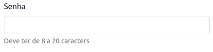
```html
<label for="senha" class="form-label">Senha</label>
<input type="password" id="senha" class="form-control" aria-describedby="passwordHelpBlock">
<div id="passwordHelpBlock" class="form-text">
  Deve ter de 8 a 20 caracters
</div>
```

No exemplo acima há três classes que merecem destaque neste momento.

`form-label`
: Formata o rótulo do campo.

`form-control`
: Responsável pela formatação visual da caixa de texto.

`form-text`
: Responsável pela formatação visual de algum texto explicativo sobre os campos do formulário.

Os campos de texto podem ainda terem o tamanho de suas fontes alteradas, como no exemplo abaixo.

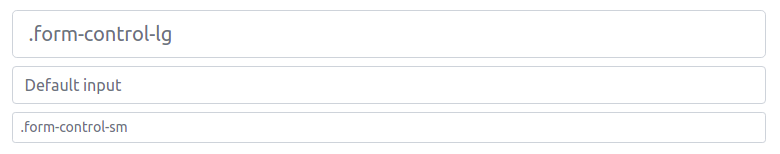

```html
<input class="form-control form-control-lg" type="text" placeholder=".form-control-lg" aria-label=".form-control-lg example">
<input class="form-control" type="text" placeholder="Default input" aria-label="default input example">
<input class="form-control form-control-sm" type="text" placeholder=".form-control-sm" aria-label=".form-control-sm example">
```

No exemplo acima as classes `form-control-lg` e `form-control-sm` foram **acrescentadas** para alterar o tamanho da fonte, mas o `form-control` permanece para manter as outras formatações.


### Caixas de seleção
Voltados para o componente html `<select>`, a classe `form-select` aplica uma formatação semelhante as caixas de texto. Sua variação de tamanho é obtida com as classes `form-select-lg` e `form-select-sm`.

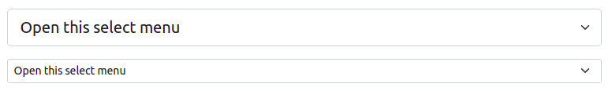

```html
<select class="form-select form-select-lg mb-3" aria-label=".form-select-lg example">
  <option selected>Open this select menu</option>
  <option value="1">One</option>
  <option value="2">Two</option>
  <option value="3">Three</option>
</select>

<select class="form-select form-select-sm" aria-label=".form-select-sm example">
  <option selected>Open this select menu</option>
  <option value="1">One</option>
  <option value="2">Two</option>
  <option value="3">Three</option>
</select>
```

### Botão de seleção e caixa de marcação
Os botões de seleção (`<input type="radio">`) e as caixas de marcação (`<input type="checkbox">`) compartilham a classe `form-check-input` para sua formatação. Essa classe precisa ser utilizada em parceria com a classe `form-check`, como mostrado no exemplo abaixo.

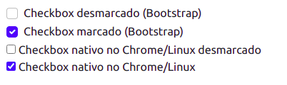
```html
<div class="form-check">
  <input class="form-check-input" type="checkbox" value="" id="flexCheckDefault">
  <label class="form-check-label" for="flexCheckDefault">
    Checkbox desmarcado (Bootstrap)
  </label>
</div>
<div class="form-check">
  <input class="form-check-input" type="checkbox" value="" id="flexCheckChecked" checked>
  <label class="form-check-label" for="flexCheckChecked">
    Checkbox marcado (Bootstrap)
  </label>
</div>   

<div>
  <input type="checkbox" value="" id="flexCheckDefaultNative">
  <label class="form-check-label" for="flexCheckDefaultNative">
    Checkbox nativo no Chrome/Linux desmarcado
  </label>
</div>

<div>
  <input type="checkbox" value="" id="flexCheckCheckedNative" checked>
  <label class="form-check-label" for="flexCheckCheckedNative">
    Checkbox nativo no Chrome/Linux
  </label>
</div>
```
As quatro caixas mostram caixas de marcação do Bootstrap (os dois primeiros exemplos) e as nativas em um SO Linux com o Google Chrome (as duas últimas). É perceptível que há diferenças visuais entre elas, sendo possível obter a mesma apresentação em navegadores/SO diferentes, pois cada conjunto de navegador/SO pode apresentar a caixa de marcação de uma forma completamente diferente.

O mesmo acontece com o botão de seleção (*radio button*), em que a exibição do Bootstrap difere da apresentada nativamente pelo SO/navegador.

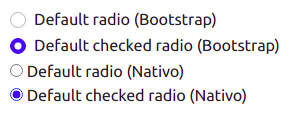
```html
<div class="form-check">
  <input class="form-check-input" type="radio" name="flexRadioDefault" id="flexRadioDefault1">
  <label class="form-check-label" for="flexRadioDefault1">
    Default radio (Bootstrap)
  </label>
</div>
<div class="form-check">
  <input class="form-check-input" type="radio" name="flexRadioDefault" id="flexRadioDefault2" checked>
  <label class="form-check-label" for="flexRadioDefault2">
    Default checked radio (Bootstrap)
  </label>
</div>

<div>
  <input type="radio" name="flexRadioDefaultNative" id="flexRadioDefault1Native">
  <label for="flexRadioDefault1Native">
    Default radio (Nativo)
  </label>
</div>
<div>
  <input type="radio" name="flexRadioDefaultNative" id="flexRadioDefault2Native" checked>
  <label for="flexRadioDefault2Native">
    Default checked radio (Nativo)
  </label>
</div>
```

Note aqui que a dupla `form-check` e `form-check-input` foram utilizadas para conseguir a apresentação das duas primeiras caixas.

#### Switches

Para além dos componentes existentes nativamente no HTML, o Bootstrap consegue algumas formas de exibição mais elaboradas, como é o caso do *switch* para substituir visualmente a caixa de marcação (*checkbox*). Observem o exemplo.

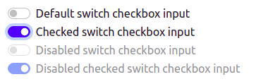

```html
<div class="form-check form-switch">
  <input class="form-check-input" type="checkbox" role="switch" id="flexSwitchCheckDefault">
  <label class="form-check-label" for="flexSwitchCheckDefault">Default switch checkbox input</label>
</div>
<div class="form-check form-switch">
  <input class="form-check-input" type="checkbox" role="switch" id="flexSwitchCheckChecked" checked>
  <label class="form-check-label" for="flexSwitchCheckChecked">Checked switch checkbox input</label>
</div>
<div class="form-check form-switch">
  <input class="form-check-input" type="checkbox" role="switch" id="flexSwitchCheckDisabled" disabled>
  <label class="form-check-label" for="flexSwitchCheckDisabled">Disabled switch checkbox input</label>
</div>
<div class="form-check form-switch">
  <input class="form-check-input" type="checkbox" role="switch" id="flexSwitchCheckCheckedDisabled" checked disabled>
  <label class="form-check-label" for="flexSwitchCheckCheckedDisabled">Disabled checked switch checkbox input</label>
</div>
```

Esta apresentação é muito utilizada em dispositivos móveis e foi conseguida **acrescentando** a classe `form-switch` junto com o `form-check`. O `<input>` não sofreu nenhuma alteração de suas classes.

#### Exibição em linha
O *radio button* e o *checkbox* podem ser exibidos no formato *inline*, um ao lado do outro, ocupando assim menos espaço. Essa formatação é obtida com a classe `form-check-inline`.

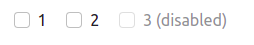

```html
<div class="form-check form-check-inline">
  <input class="form-check-input" type="checkbox" id="inlineCheckbox1" value="option1">
  <label class="form-check-label" for="inlineCheckbox1">1</label>
</div>
<div class="form-check form-check-inline">
  <input class="form-check-input" type="checkbox" id="inlineCheckbox2" value="option2">
  <label class="form-check-label" for="inlineCheckbox2">2</label>
</div>
<div class="form-check form-check-inline">
  <input class="form-check-input" type="checkbox" id="inlineCheckbox3" value="option3" disabled>
  <label class="form-check-label" for="inlineCheckbox3">3 (disabled)</label>
</div>
```

A aplicação é feita junto com o `form-check`, informando que o rótulo deve ser exibido junto com a caixa de marcação e que todas as opções deverão ser exibidas uma ao lado da outra.


### Range
O HTML 5 trouxe um novo tipo para o `<input>`, que é o tipo *range*. O HTML é `<input type="range">` que é uma especie de seletor para um intervalo conhecido. Abaixo a representação do componente.

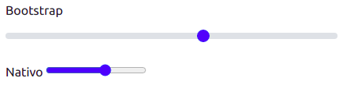

```html
<div>
  <label for="customRange1" class="form-label">Bootstrap</label>
  <input type="range" class="form-range" min="0" max="5" id="customRange1">
</div>

<div class="mt-3">
  <label for="customRange2" class="form-label">Nativo</label>
  <input type="range" min="0" max="5" id="customRange2">
</div>
```

Acima o exemplo do *range* no formato nativo do navegador e no Bootstrap.

### Grupos de *input*
Os grupos de *input* permitem apresentar os componentes com uma outra apresentação. Veja o exemplo abaixo.

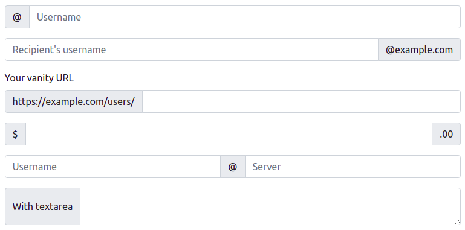
```html
<div class="input-group mb-3">
  <span class="input-group-text" id="basic-addon1">@</span>
  <input type="text" class="form-control" placeholder="Username" aria-label="Username" aria-describedby="basic-addon1">
</div>

<div class="input-group mb-3">
  <input type="text" class="form-control" placeholder="Recipient's username" aria-label="Recipient's username" aria-describedby="basic-addon2">
  <span class="input-group-text" id="basic-addon2">@example.com</span>
</div>

<label for="basic-url" class="form-label">Your vanity URL</label>
<div class="input-group mb-3">
  <span class="input-group-text" id="basic-addon3">https://example.com/users/</span>
  <input type="text" class="form-control" id="basic-url" aria-describedby="basic-addon3">
</div>

<div class="input-group mb-3">
  <span class="input-group-text">$</span>
  <input type="text" class="form-control" aria-label="Amount (to the nearest dollar)">
  <span class="input-group-text">.00</span>
</div>

<div class="input-group mb-3">
  <input type="text" class="form-control" placeholder="Username" aria-label="Username">
  <span class="input-group-text">@</span>
  <input type="text" class="form-control" placeholder="Server" aria-label="Server">
</div>

<div class="input-group">
  <span class="input-group-text">With textarea</span>
  <textarea class="form-control" aria-label="With textarea"></textarea>
</div>
```

Observe as classes `input-group` e `input-group-text`. Elas trabalham em conjunto para formar, visualmente, uma única entrada de dados, dando a impressão que a caixa de texto possui um conteúdo anexo para auxiliar no preenchimento.

#### Variação de tamanho
O grupo de *input* também pode ter o seu tamanho modificado com as classes `input-group-sm` e `input-group-lg`.

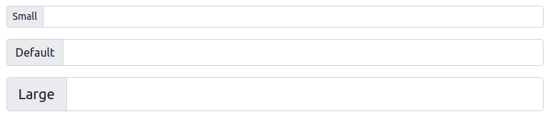

```html
<div class="input-group input-group-sm mb-3">
  <span class="input-group-text" id="inputGroup-sizing-sm">Small</span>
  <input type="text" class="form-control" aria-label="Sizing example input" aria-describedby="inputGroup-sizing-sm">
</div>

<div class="input-group mb-3">
  <span class="input-group-text" id="inputGroup-sizing-default">Default</span>
  <input type="text" class="form-control" aria-label="Sizing example input" aria-describedby="inputGroup-sizing-default">
</div>

<div class="input-group input-group-lg">
  <span class="input-group-text" id="inputGroup-sizing-lg">Large</span>
  <input type="text" class="form-control" aria-label="Sizing example input" aria-describedby="inputGroup-sizing-lg">
</div>
```

Um detalhamento melhor e com muito mais exemplos para os grupos de *input* podem ser encontrados na [documentação oficial](https://getbootstrap.com/docs/5.1/forms/input-group/) do Bootstrap.

### Rótulos flutuantes
Os rótulos flutuantes é mais uma opção de exibição dos rótulos junto com os campos, fugindo daquele padrão em que o rótulo vem imediatamente antes do campo de texto. Neste formato de exibição, o rótulo é exibido dentro do campo e quando o usuário.

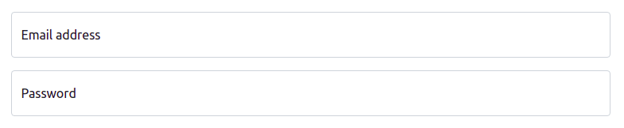

```html
<div class="form-floating mb-3">
  <input type="email" class="form-control" id="floatingInput" placeholder="name@example.com">
  <label for="floatingInput">Email address</label>
</div>
<div class="form-floating">
  <input type="password" class="form-control" id="floatingPassword" placeholder="Password">
  <label for="floatingPassword">Password</label>
</div>
```

A animação acima ilustra o que acontece quando o usuário acessa o campo de texto. O rótulo passa por uma animação em que irá se deslocar, abrindo espaço para digitação. Para implementar este recurso tanto o rótulo quanto o campo de texto precisam estar dentro do mesmo elemento que deve estar formatado com a classe `form-floating`. No exemplo acima o `<div class="form-floating">` é o elemento que irá conter o `<input>` e o `<label>`. Outro ponto importante é que a ordem entre o `<input>` e o `<label>` é alterada.

Este tipo de flutuação funcionará com os `<input>` de texto, `<textarea>` e `<select>`.

### *Layout* do formulário
O formulário pode ser formatado com as estruturas de layout já existente, como o sistema de grid, flexbox, etc.

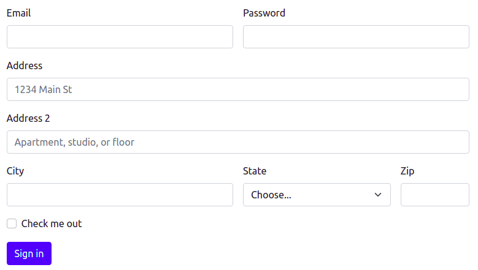

```html
<form class="row g-3">
  <div class="col-md-6">
    <label for="inputEmail4" class="form-label">Email</label>
    <input type="email" class="form-control" id="inputEmail4">
  </div>
  <div class="col-md-6">
    <label for="inputPassword4" class="form-label">Password</label>
    <input type="password" class="form-control" id="inputPassword4">
  </div>
  <div class="col-12">
    <label for="inputAddress" class="form-label">Address</label>
    <input type="text" class="form-control" id="inputAddress" placeholder="1234 Main St">
  </div>
  <div class="col-12">
    <label for="inputAddress2" class="form-label">Address 2</label>
    <input type="text" class="form-control" id="inputAddress2" placeholder="Apartment, studio, or floor">
  </div>
  <div class="col-md-6">
    <label for="inputCity" class="form-label">City</label>
    <input type="text" class="form-control" id="inputCity">
  </div>
  <div class="col-md-4">
    <label for="inputState" class="form-label">State</label>
    <select id="inputState" class="form-select">
      <option selected>Choose...</option>
      <option>...</option>
    </select>
  </div>
  <div class="col-md-2">
    <label for="inputZip" class="form-label">Zip</label>
    <input type="text" class="form-control" id="inputZip">
  </div>
  <div class="col-12">
    <div class="form-check">
      <input class="form-check-input" type="checkbox" id="gridCheck">
      <label class="form-check-label" for="gridCheck">
        Check me out
      </label>
    </div>
  </div>
  <div class="col-12">
    <button type="submit" class="btn btn-primary">Sign in</button>
  </div>
</form>
```

No exemplo acima é utilizado o sistema de grid para diagramar o formulário, permitindo que os campos ocupem a mesma linha. Este mesmo formulário terá uma exibição diferente em um dispositivo móvel.

#### Formulário horizontal
Outra forma de exibir os rótulos é na mesma linha em que o campo é exibido. Isso é obtido através do **sistema de grid e da classe `col-form-label`**.

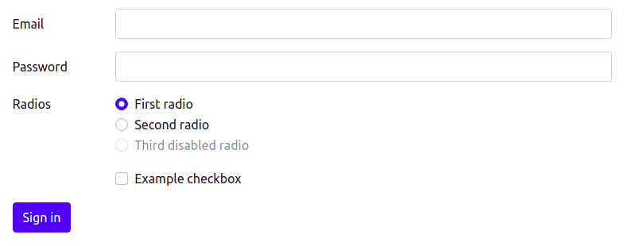

```html
<form>
  <div class="row mb-3">
    <label for="inputEmail3" class="col-sm-2 col-form-label">Email</label>
    <div class="col-sm-10">
      <input type="email" class="form-control" id="inputEmail3">
    </div>
  </div>
  <div class="row mb-3">
    <label for="inputPassword3" class="col-sm-2 col-form-label">Password</label>
    <div class="col-sm-10">
      <input type="password" class="form-control" id="inputPassword3">
    </div>
  </div>
  <fieldset class="row mb-3">
    <legend class="col-form-label col-sm-2 pt-0">Radios</legend>
    <div class="col-sm-10">
      <div class="form-check">
        <input class="form-check-input" type="radio" name="gridRadios" id="gridRadios1" value="option1" checked>
        <label class="form-check-label" for="gridRadios1">
          First radio
        </label>
      </div>
      <div class="form-check">
        <input class="form-check-input" type="radio" name="gridRadios" id="gridRadios2" value="option2">
        <label class="form-check-label" for="gridRadios2">
          Second radio
        </label>
      </div>
      <div class="form-check disabled">
        <input class="form-check-input" type="radio" name="gridRadios" id="gridRadios3" value="option3" disabled>
        <label class="form-check-label" for="gridRadios3">
          Third disabled radio
        </label>
      </div>
    </div>
  </fieldset>
  <div class="row mb-3">
    <div class="col-sm-10 offset-sm-2">
      <div class="form-check">
        <input class="form-check-input" type="checkbox" id="gridCheck1">
        <label class="form-check-label" for="gridCheck1">
          Example checkbox
        </label>
      </div>
    </div>
  </div>
  <button type="submit" class="btn btn-primary">Sign in</button>
</form>
```

Os rótulos recebem a classe `col-form-label` quando precisam ficar lado a lado ao campo que representa. As classes `row` e `col-*` são usadas para separar o quanto de espaço cada um (rótulo e campo) irá ocupar.

### Validação
A etapa de validação não ficou pronta para este roteiro, consulte a [documentação oficial](https://getbootstrap.com/docs/5.1/forms/validation/).

## Atividade
1. Implemente um formulário que tenha a mesma aparência que os exemplos abaixo. Observe que o mesmo formulário deverá ter uma apresentação levemente diferente entre um dispositivo *mobile* (extra pequeno, pequeno e médio) e em *desktop* (grande, extra grande e extra extra grande). A primeira figura (que é uma animação) é a versão *desktop* e a segunda a versão *mobile*.
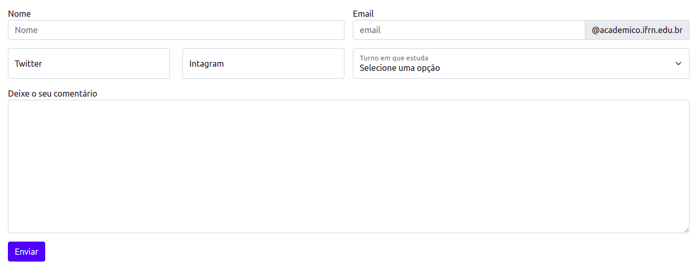
